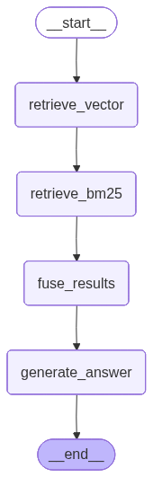

# Hybrid RAG — PDF Question Answering with Dual Retrieval

A **Hybrid Retrieval-Augmented Generation** application that lets you upload PDF documents and ask questions against them using a combination of dense vector search (ChromaDB) and sparse keyword search (BM25), fused together with Reciprocal Rank Fusion (RRF). Answers are generated via a LangGraph pipeline using your choice of models from **NVIDIA, Cerebras, or Groq**, with a full observability panel showing retrieved chunks, token usage, and latency.



---

## Features

- 📄 **Multi-PDF upload & indexing** — Upload one or more PDFs; all are chunked and indexed together into a single ChromaDB + BM25 index.
- 🔀 **Hybrid retrieval** — Switch between:
  - **Both** (default) — ChromaDB dense search + BM25 keyword search, merged with RRF
  - **Vector** — ChromaDB semantic search only
  - **BM25** — Sparse keyword search only
- 🤖 **Provider Selection** — Choose your preferred LLM provider from the sidebar: NVIDIA, Cerebras, or Groq.
- 🎚️ **Configurable Top-K** — Slider to control how many chunks (3–10) are passed to the LLM.
- 💬 **Chat interface** — Persistent conversation history with **Answer** and **Logs** tabs per response.
- 🔍 **Observability panel (Logs tab)** — For every response, inspect:
  - Retrieved chunks ranked by Vector, BM25, and RRF scores, colour-coded by source (`Both` / `Vector` / `BM25`)
  - Full prompt sent to the LLM
  - Token usage (input / output / total)
  - LLM call latency (ms)

---

## Architecture

```
┌────────────────────────────────────────────────────────────┐
│  Streamlit UI  (app.py)                                    │
│  ┌──────────────┐  ┌────────────────────────────────────┐  │
│  │ Sidebar       │  │ Chat Area                          │  │
│  │ • PDF upload  │  │ • Chat history (Answer / Logs)     │  │
│  │ • Index docs  │  │ • Text input + Send button         │  │
│  │ • Mode select │  │                                    │  │
│  │ • Provider    │  │                                    │  │
│  │ • Top-K slider│  │                                    │  │
│  └──────────────┘  └────────────────────────────────────┘  │
└─────────────────────────┬──────────────────────────────────┘
                          │ query
                          ▼
┌────────────────────────────────────────────────────────────┐
│  LangGraph Pipeline  (graph.py)                            │
│                                                            │
│  START → retrieve_vector → retrieve_bm25                   │
│               → fuse_results → generate_answer → END       │
└─────┬────────────────┬──────────────┬──────────────────────┘
      │                │              │
      ▼                ▼              ▼
 ChromaDB Index    BM25 Index    NVIDIA/Cerebras/Groq
(vector_retriever) (bm25_retriever)   (LangChain)
      └──────────────────┘
              │
         RRF Fusion
         (fusion.py)
```

### Module Overview

| Module | Description |
|---|---|
| [app.py](app.py) | Streamlit UI — sidebar, chat interface, observability panel |
| [graph.py](graph.py) | LangGraph pipeline factory and standalone `parse_and_index()` helper |
| [indexer/pdf_indexer.py](indexer/pdf_indexer.py) | PDF extraction (PyMuPDF), token-based chunking, ChromaDB + BM25 index builders |
| [retriever/vector_retriever.py](retriever/vector_retriever.py) | Dense retrieval using ChromaDB and `all-MiniLM-L6-v2` embeddings |
| [retriever/bm25_retriever.py](retriever/bm25_retriever.py) | Sparse BM25Okapi keyword retrieval |
| [retriever/fusion.py](retriever/fusion.py) | Reciprocal Rank Fusion implementation |
| [monitoring/chunk_monitor.py](monitoring/chunk_monitor.py) | In-session query history logger (last 5 entries) |

---

## Setup

### Prerequisites

- Python 3.10+
- API keys for your choice of LLM provider(s): [NVIDIA](https://build.nvidia.com/), [Cerebras](https://cerebras.net/), or [Groq](https://console.groq.com/).

### Installation

1. **Clone the repository**

   ```bash
   git clone <repo-url>
   cd hackathon-example-hybrid-rag
   ```

2. **Create and activate a virtual environment**

   ```bash
   python -m venv .venv
   source .venv/bin/activate   # Windows: .venv\Scripts\activate
   ```

3. **Install dependencies**

   ```bash
   pip install -r requirements.txt
   ```

4. **Configure your API keys**

   Create a `.env` file in the project root:

   ```env
   NVIDIA_API_KEY=your_nvidia_key
   CEREBRAS_API_KEY=your_cerebras_key
   GROQ_API_KEY=your_groq_key
   ```

---

## Running the App

```bash
streamlit run app.py
```

The app opens at [http://localhost:8501](http://localhost:8501).

---

## Usage

1. **Upload PDFs** — Use the sidebar to upload one or more PDF files. Text-only PDFs are supported; scanned image-only PDFs are not.
2. **Index Documents** — Click **⚡ Index Documents**. A ChromaDB vector collection and BM25 keyword index are built over all uploaded files.
3. **Select Provider** — Choose which LLM provider to generate the answers with: NVIDIA, Cerebras, or Groq.
4. **Select Retrieval Mode** — Choose `Both`, `Vector`, or `BM25` from the sidebar dropdown.
5. **Adjust Top-K** — Use the slider to control how many chunks are retrieved and passed to the LLM (3–10).
6. **Ask Questions** — Type your question in the chat input and click **Send ➤**.
7. **Inspect Logs** — Click the **Logs** tab on any response to see chunk scores, the exact prompt, token usage, and latency.

---

## Technical Details

### Chunking Strategy

PDFs are parsed page-by-page with **PyMuPDF**, whitespace-tokenised, then split into overlapping windows:

- **Chunk size:** 200 tokens
- **Overlap:** 50 tokens (stride of 150)
- Each chunk is attributed to the page number of its first token.

### Embedding Model

Dense retrieval uses **`all-MiniLM-L6-v2`** (384-dimensional) from `sentence-transformers`. The model is loaded once per Python process and reused for both indexing and query encoding.

### ChromaDB Index

An ephemeral (in-memory) ChromaDB collection is used to store chunks and metadata (page numbers), providing seamless embedding and query operations over cosine similarity.

### BM25

`BM25Okapi` from `rank_bm25`. Queries and documents are lowercased before tokenisation for case-insensitive matching.

### Reciprocal Rank Fusion

Standard RRF with smoothing constant **k = 60**:

```
score(d) = Σ  1 / (60 + rank(d))
```

Results from both retrievers are merged; chunks appearing in both lists receive contributions from both ranks.

### LangGraph Pipeline

The per-query graph is built fresh on every `Send` click (negligible cost) so `top_k`, `retrieval_mode`, and `llm_provider` settings are always captured as closures. Indexes live in `st.session_state` — not in `RAGState` — to avoid serialisation overhead.

---

## Generating the Graph Diagram

```bash
python graph.py                  # saves graph.png next to graph.py
python graph.py docs/pipeline.png  # custom output path
```

---

## Dependencies

| Package | Purpose |
|---|---|
| `langchain-nvidia-ai-endpoints` | NVIDIA LLM client |
| `langchain-cerebras` | Cerebras LLM client |
| `langchain-groq` | Groq LLM client |
| `langchain-core` | Core abstraction for LangChain |
| `langgraph` | RAG pipeline orchestration |
| `langchain-chroma` | Chroma vector store |
| `sentence-transformers` | `all-MiniLM-L6-v2` embeddings |
| `rank_bm25` | BM25Okapi sparse retrieval |
| `PyMuPDF` | PDF text extraction |
| `streamlit` | Web UI |
| `pandas` | Chunk table rendering |
| `numpy` | Embedding array operations |
| `python-dotenv` | `.env` file loading |